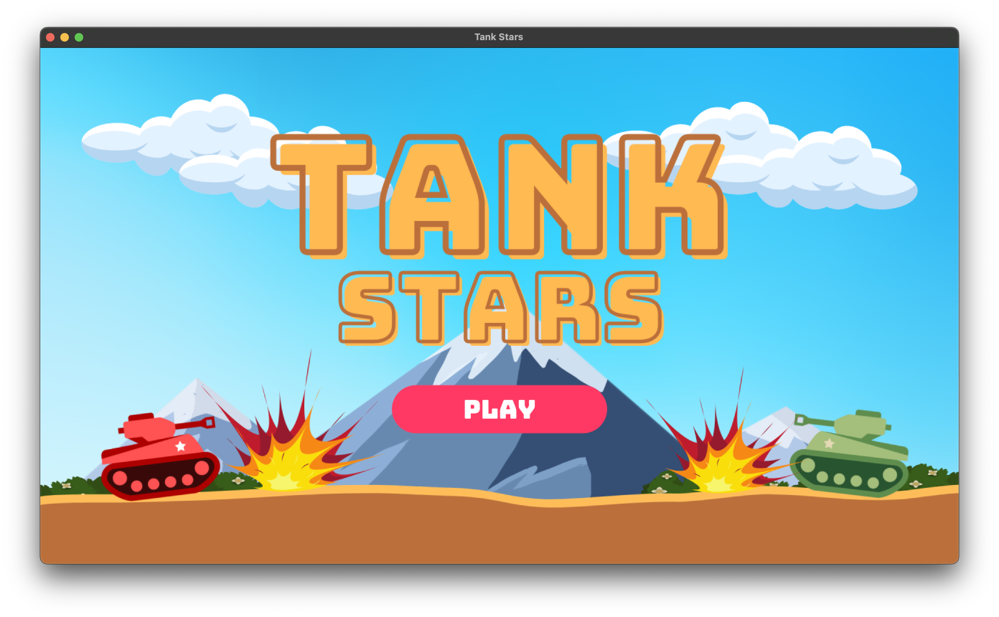

# TankStars

Made a very simple yet beautiful looking game using Java's game development engine - LibGDX




## Features:

- Player can choose between three tanks !!
- Player can dodge an attack !!
- Handcrafted UI
- _Many more .._

## How to Play?

User can launch the game by executing the ```run``` which can be found in gradle option (located on the right pane - IntelliJ Idea) then ```TankStarsGame > desktop > other > run```

## Basic Controls

### Player 1

- Press ```A``` or ```D``` to move tank **Left** or **Right** side respectively.
- Press ```LEFT SHIFT``` to shoot bullets at an angle of 45 degrees.
- Hold ```W``` while shooting bullets to decrease the angle.

### Player 2

- Press ```LEFT``` or ```RIGHT``` arrow keys to move tank **Left** or **Right** side respectively
- Press ```RIGHT SHIFT``` to shoot bullets at an angle of 45 degrees.
- Hold ```UP``` arrow key while shooting bullets to decrease the angle.

---

# Contributors :

- [Lakshay Bhushan](https://github.com/lakshaybhushan)
- [Twisha Kacker](https://github.com/Twisha-21432)
